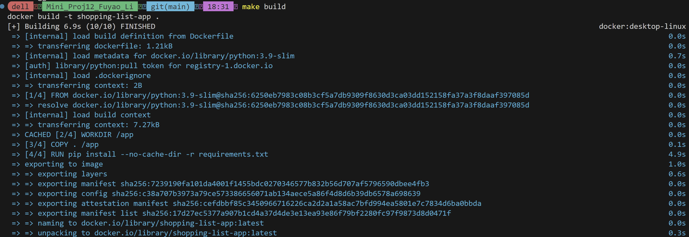
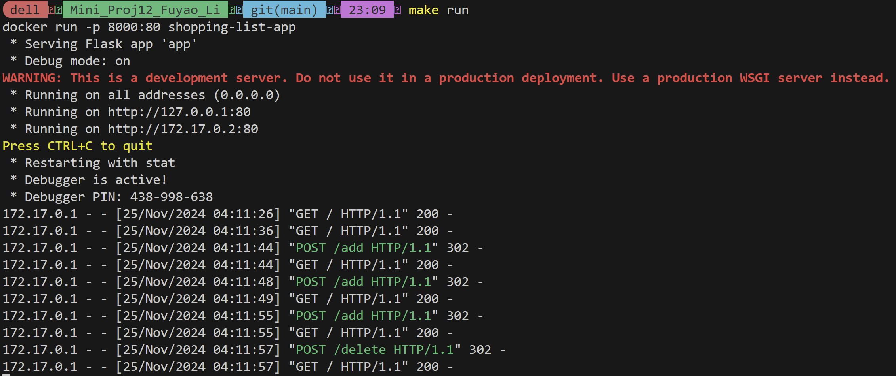
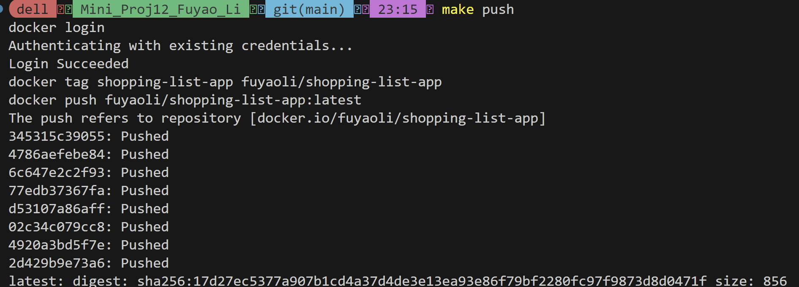
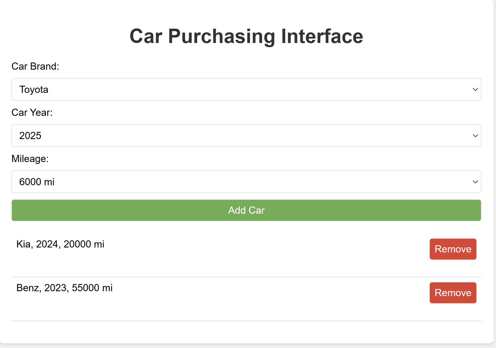

# Mini_Proj12_Fuyao_Li

### Author: Fuyao Li

## Requirement：
Create a simple python application containerized with a dockerfile. The goal here is to both demonstrate running your application within a docker container (using docker run terminal commands) but to also build a docker image in your CI/CD pipeline which will be pushed to Docker Hub or other container management service.

## Set up:
1. Clone the repository:
``` shell
git clone git@github.com:nogibjj/Mini_Proj12_Fuyao_Li.git
```
2. Create a virtual environment
``` shell
conda create --name test python=3.9
conda activate test
```
3. Install required packages
``` shell
pip install -r requirements.txt
```

## Run Application within a Docker Container
1. `make build`:


2. `make run`:

**The Flask app will be accessible at http://127.0.0.1:8000/.**


## Build Docker Image
1. docker login:
`docker login`

2. `make push`:



## Web Application Description
This is a simple Flask-based web application for selecting and managing a list of cars based on predefined options for car brand, year, and mileage. Users can add cars to their selection and remove them as needed. The app is fully interactive and runs on a web browser.



#### Interactive Car Selection:
+ Users can select a car from dropdown menus for:
    - Car brands: Toyota, Kia, Benz, BMW.
    - Car years: 2025, 2024, 2023, 2022, 2021.
    - Car mileage: 6000 mi, 20000 mi, 30000 mi, 55000 mi.

+ Add Cars to a Selection List:
Once a car is selected, it gets added to the list displayed on the page.

+ Remove Cars from the Selection:
Users can remove cars from the list by clicking the "Remove" button next to the car entry.

+ Responsive User Interface:
Built-in styling ensures a clean and user-friendly experience.

+ Dynamic Content:
The list of selected cars dynamically updates without requiring a page reload.
